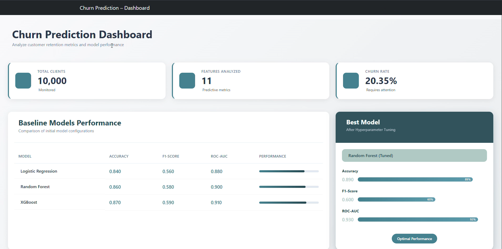

# 🔮 API Churn Prediction – Flask + Swagger + Machine Learning

Cette API permet :

- d'afficher un tableau de bord statistique sur les modèles ML,
- de charger un modèle de prédiction du churn (RandomForest/XGBoost),
- de prédire si un client risque de churn,
- d’être consommée par un frontend Angular,
- de tester directement tous les endpoints via Swagger UI.

---

## 📁 1. Structure du projet

```
backend/
│
├── app.py                     → API Flask + Swagger
├── model.py                   → Chargement du modèle ML, prédiction, stats
├── requirements.txt           → Dépendances du projet
│
└── models/
    ├── random_forest_tuned.joblib
    └── scaler.joblib
```

---

## 🚀 2. Installation

### 2.1. Cloner le projet

```bash
git clone <URL_DU_PROJET>
cd backend
```

### 2.2. Créer un environnement virtuel

```bash
python -m venv venv
```

### 2.3. Activer l’environnement

#### Windows :
```bash
venv\Scripts\activate
```


### 2.4. Installer les dépendances

```bash
pip install -r requirements.txt
```

---

## 🧠 3. Lancer le serveur Flask

```bash
python app.py
```

L’API est maintenant disponible à :

```
http://localhost:5000
```

Swagger UI est disponible ici :

➡️ **http://localhost:5000/apidocs**

---

## 🧠 3.1. Lancer Angular

```bash
cd frontend
```

```bash
ng serve --open
```

L’API est maintenant disponible à :

```
http://localhost:4200/
```
----

## 📡 4. Endpoints disponibles

### ✔ `/api/health`  
Vérifie que l’API fonctionne.

**Réponse :**
```json
{ "status": "ok" }
```

---

### ✔ `/api/dashboard`  
Renvoie des statistiques pour le tableau de bord Angular :

- caractéristiques du dataset  
- performances des modèles ML  
- meilleur modèle après fine-tuning  
- top features ex. (Age, NumOfProducts…)  

---

### ✔ `/api/predict` (POST)  
Prédit si un client va churn ou non.

**Exemple de corps JSON attendu :**
```json
{
  "CreditScore": 650,
  "Gender": 0,
  "Age": 40,
  "Tenure": 5,
  "Balance": 60000,
  "NumOfProducts": 2,
  "HasCrCard": 1,
  "IsActiveMember": 1,
  "EstimatedSalary": 80000,
  "Geography_Germany": 0,
  "Geography_Spain": 1
}
```

**Réponse exemple :**
```json
{
  "success": true,
  "result": {
    "prediction": 1,
    "label": "Churn",
    "probability": 0.67
  }
}
```

---

## 🌐 5. Intégration Angular

### Importer HttpClientModule dans Angular :

```ts
import { HttpClientModule } from '@angular/common/http';
```

### Service Angular :

```ts
this.http.get("http://localhost:5000/api/dashboard");
this.http.post("http://localhost:5000/api/predict", payload);
```

CORS est déjà activé côté Flask.

---

## 🧪 6. Tester l’API via Swagger

Swagger UI est accessible à :

➡️ http://localhost:5000/apidocs

Vous pouvez :

- exécuter toutes les requêtes
- modifier le JSON d’entrée
- visualiser les résultats formats JSON
- tester rapidement sans Postman

---

## 🖼️ Demo (Screenshots)

### 🔹 Customer Info


### 🔹 Dashboard


### 🔹 Predicted Features


### 🔹 Prediction Result


